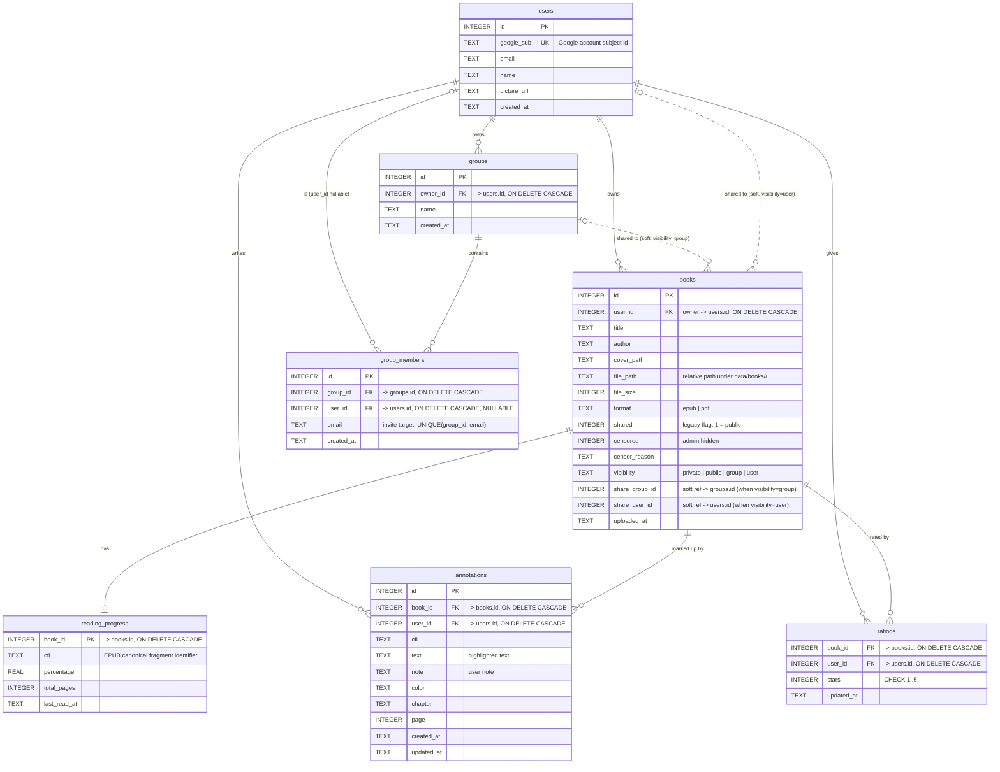

# Data model

The source of truth is `server/src/db.js` (SQLite, `foreign_keys = ON`). This
diagram is generated by hand from that schema; update it when the schema changes.

## Notes

- **Cardinality legend:** `||` one, `o|` zero-or-one, `o{` zero-or-many. Solid
  lines are DB-enforced foreign keys; dashed lines (`..`) are *soft* references
  stored as plain integer columns with no `REFERENCES` constraint.
- **Composite keys.** `reading_progress` is keyed by `book_id` (one row per
  book). `ratings` has a composite primary key `(book_id, user_id)`, so a user
  rates a given book at most once.
- **Cascade deletes.** Deleting a `users` row cascades to that user's `books`,
  `annotations`, `ratings`, owned `groups`, and their `group_members` rows;
  deleting a `books` row cascades to its `reading_progress`, `annotations`, and
  `ratings`. This is what powers account deletion (`DELETE /api/auth/account`).
- **Soft references are not cascaded.** Because `books.share_group_id` and
  `books.share_user_id` are not real foreign keys, deleting a group or a share
  target leaves them dangling; the account-deletion path resets those books back
  to `visibility='private'` explicitly rather than relying on the database.
- **Pending invitations.** `group_members.user_id` is nullable: a row can exist
  for an invited `email` before that person has an account, and is linked to a
  real `user_id` on their first login (`linkPendingMemberships`).
- **Visibility model.** `books.visibility` (`private | public | group | user`)
  is the current sharing control; `books.shared` is the legacy boolean kept in
  sync for public books. `share_group_id` / `share_user_id` carry the target
  when visibility is `group` / `user`.
